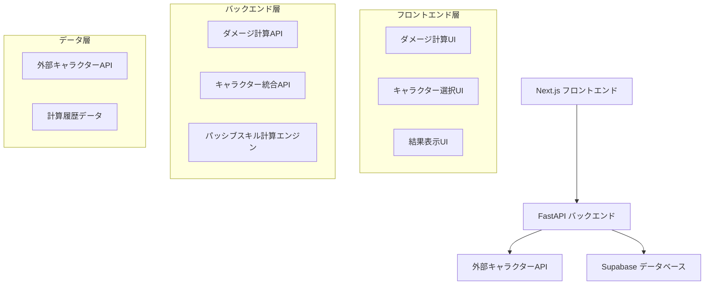

# 設計書

## 概要

ドラゴンボール Z ドッカンバトルのダメージ計算アプリケーションは、Next.js フロントエンド、FastAPI バックエンド、外部キャラクター API 統合で構成される Web アプリケーションです。ユーザーはキャラクターの防御ステータス、リーダースキル倍率、キャラクター情報、敵の攻撃値を入力して受けるダメージを計算できます。

## アーキテクチャ

### システム構成図



### 技術スタック

- **フロントエンド**: Next.js 14, React, TypeScript, Tailwind CSS
- **バックエンド**: FastAPI, Python 3.11+, Pydantic
- **Python 環境管理**: venv (仮想環境)
- **データベース**: Supabase (PostgreSQL)
- **外部 API 統合**: HTTP クライアント (httpx)
- **デプロイ**: Vercel (フロントエンド), Railway/Heroku (バックエンド)

## コンポーネントとインターフェース

### フロントエンドコンポーネント

#### 1. DamageCalculatorForm

- **責任**: ユーザー入力の収集と検証
- **プロパティ**:
  - defStat: number
  - leaderSkillMultiplier: number
  - selectedCharacter: Character
  - enemyAttack: number
  - attackCount: number (DEF 無限上昇キャラクター用)

#### 2. CharacterSelector

- **責任**: 外部 API からキャラクター一覧を取得・表示
- **状態管理**:
  - loading: boolean
  - characters: Character[]
  - error: string | null
- **機能**:
  - 検索・フィルタリング
  - ローディング状態表示
  - エラーハンドリング

#### 3. DamageResultDisplay

- **責任**: 計算結果の表示
- **表示項目**:
  - 実効防御力
  - 受けるダメージ
  - 適用された修正値の詳細

### バックエンド API

#### 1. ダメージ計算エンドポイント

```python
POST /api/calculate-damage
{
    "def_stat": int,
    "leader_skill_multiplier": float,
    "character_id": str,
    "enemy_attack": int,
    "attack_count": int
}
```

#### 2. キャラクター取得エンドポイント

```python
GET /api/characters
GET /api/characters/{character_id}
```

### 外部 API 統合

#### キャラクター API クライアント

- **エンドポイント**: 外部ドッカンバトル API
- **機能**:
  - キャラクター一覧取得
  - キャラクター詳細取得
  - パッシブスキル情報取得
- **エラーハンドリング**:
  - タイムアウト処理 (30 秒)
  - リトライ機構 (3 回まで)
  - フォールバック処理

## データモデル

### Character (キャラクター)

```typescript
interface Character {
  id: string;
  name: string;
  rarity: number;
  type: string;
  passiveSkills: PassiveSkill[];
  defenseMultiplier?: number;
  damageReduction?: number;
  guardAbility?: boolean;
  infiniteDefenseStacking?: boolean;
}
```

### PassiveSkill (パッシブスキル)

```typescript
interface PassiveSkill {
  id: string;
  type: "defense_boost" | "damage_reduction" | "guard" | "infinite_stacking";
  value: number;
  condition?: string;
  stackable: boolean;
}
```

### DamageCalculationRequest (ダメージ計算リクエスト)

```typescript
interface DamageCalculationRequest {
  defStat: number;
  leaderSkillMultiplier: number;
  characterId: string;
  enemyAttack: number;
  attackCount?: number;
}
```

### DamageCalculationResult (ダメージ計算結果)

```typescript
interface DamageCalculationResult {
  effectiveDefense: number;
  damageReceived: number;
  appliedModifiers: {
    leaderSkill: number;
    passiveSkills: PassiveSkill[];
    stackingBonus?: number;
  };
  calculationDetails: string;
}
```

## エラーハンドリング

### フロントエンド

- **入力検証エラー**: フォームフィールドでのリアルタイム検証
- **API 通信エラー**: トースト通知とリトライボタン表示
- **外部 API 障害**: キャッシュされたデータまたはエラーメッセージ表示

### バックエンド

- **外部 API 障害**: HTTP エラーコードに応じた適切なレスポンス
- **データ検証エラー**: Pydantic による自動検証とエラーレスポンス
- **計算エラー**: 数値オーバーフローや無効な値の処理

### エラーレスポンス形式

```json
{
  "error": {
    "code": "EXTERNAL_API_ERROR",
    "message": "キャラクターデータの取得に失敗しました",
    "details": "外部APIが一時的に利用できません"
  }
}
```

## テスト戦略

### 単体テスト

- **フロントエンド**: Jest + React Testing Library
  - コンポーネントの描画テスト
  - ユーザーインタラクションテスト
  - 状態管理テスト
- **バックエンド**: pytest
  - API エンドポイントテスト
  - ダメージ計算ロジックテスト
  - 外部 API 統合テスト (モック使用)

### 統合テスト

- **API 統合テスト**: 実際の外部 API を使用したテスト
- **エンドツーエンドテスト**: Playwright を使用したブラウザテスト

### テストデータ

- **モックキャラクターデータ**: 各種パッシブスキルパターンをカバー
- **計算テストケース**: 境界値、エッジケース、エラーケースを含む

## 開発環境セットアップ

### Python 仮想環境管理

本プロジェクトでは、Python の依存関係管理に **venv** を使用します。これにより、プロジェクト固有の依存関係を分離し、システム全体の Python 環境に影響を与えることなく開発を行えます。

#### 仮想環境の作成と有効化

```bash
# バックエンドディレクトリに移動
cd backend

# 仮想環境の作成
python3 -m venv venv

# 仮想環境の有効化
# Linux/macOS の場合:
source venv/bin/activate

# Windows の場合:
venv\Scripts\activate

# 仮想環境が有効化されていることを確認
which python  # Linux/macOS
where python   # Windows
```

#### 依存関係の管理

```bash
# 依存関係のインストール
pip install -r requirements.txt

# 新しいパッケージを追加した場合
pip freeze > requirements.txt

# 仮想環境の無効化
deactivate
```

#### 開発時の注意事項

- **必須**: 開発作業前に必ず仮想環境を有効化する
- **推奨**: IDE（VS Code 等）で Python インタープリターを仮想環境のものに設定する
- **禁止**: システム全体の Python 環境に直接パッケージをインストールしない

### Git 管理とファイル除外設定

#### .gitignore 設定

プロジェクトでは以下のファイル・ディレクトリを Git 管理から除外します：

**バックエンド（backend/.gitignore）**

- `venv/` - Python 仮想環境ディレクトリ
- `__pycache__/` - Python バイトコードファイル
- `*.py[cod]` - コンパイル済み Python ファイル
- `.env` - 環境変数ファイル（機密情報含む）
- `*.log` - ログファイル
- `.pytest_cache/` - テストキャッシュ

**フロントエンド（frontend/.gitignore）**

- `node_modules/` - Node.js 依存関係
- `.next/` - Next.js ビルド成果物
- `.env.local` - ローカル環境変数

**プロジェクトルート（.gitignore）**

- IDE 設定ファイル
- OS 生成ファイル
- 一時ファイル・キャッシュ

#### 重要な注意事項

- **環境変数ファイル（.env）は絶対にコミットしない**
- **仮想環境ディレクトリ（venv/）は除外必須**
- **機密情報を含むファイルは.gitignore で確実に除外**

### 環境変数設定

#### バックエンド環境変数 (.env)

```bash
# アプリケーション基本設定
APP_NAME="ドッカンバトル ダメージ計算 API"
DEBUG=true

# サーバー設定
HOST=0.0.0.0
PORT=8000

# CORS設定
ALLOWED_ORIGINS=http://localhost:3000,http://127.0.0.1:3000

# 外部API設定
EXTERNAL_API_TIMEOUT=30
CACHE_TTL=3600
LOG_LEVEL=INFO
```

#### フロントエンド環境変数 (.env.local)

```bash
# API エンドポイント設定
NEXT_PUBLIC_API_URL=http://localhost:8000

# アプリケーション設定
NEXT_PUBLIC_APP_NAME="ドッカンバトル ダメージ計算ツール"
NODE_ENV=development
```

## パフォーマンス考慮事項

### フロントエンド最適化

- **キャラクターデータキャッシュ**: React Query による効率的なデータ管理
- **遅延ローディング**: キャラクター画像の遅延読み込み
- **デバウンス**: 検索入力のデバウンス処理

### バックエンド最適化

- **外部 API キャッシュ**: Redis または メモリキャッシュによるレスポンス高速化
- **並行処理**: 複数キャラクター取得時の並行リクエスト
- **レート制限**: 外部 API 呼び出しの制限管理

## セキュリティ

### API セキュリティ

- **CORS 設定**: 適切なオリジン制限
- **レート制限**: DDoS 攻撃防止
- **入力検証**: SQL インジェクション、XSS 攻撃防止

### 外部 API 統合セキュリティ

- **API キー管理**: 環境変数による秘匿情報管理
- **HTTPS 通信**: すべての外部 API 通信の暗号化
- **タイムアウト設定**: 長時間のリクエスト防止
